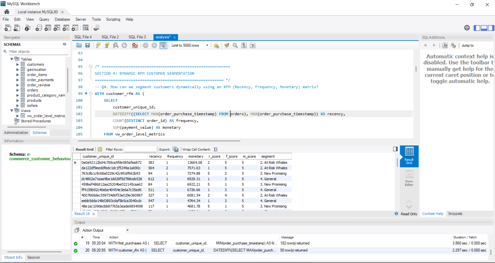
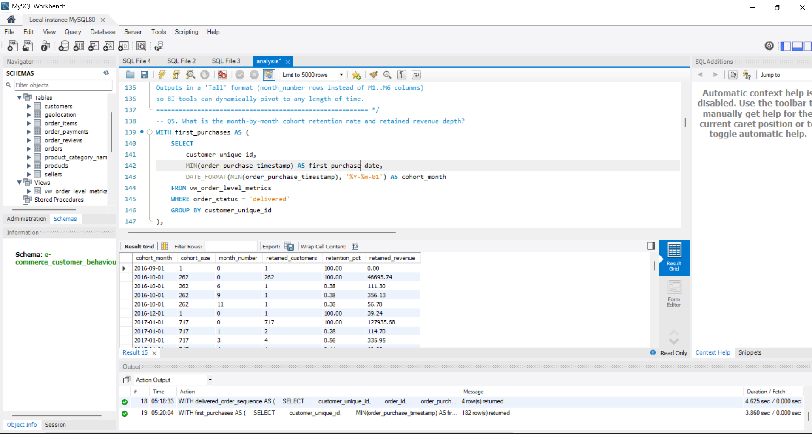

# E-Commerce Customer Behavior, Retention & Profitability Analysis

**Author:** Shivam Kumar  
**Dataset:** [Olist Brazilian E-commerce](https://www.kaggle.com/datasets/olistbr/brazilian-ecommerce) (public Kaggle dataset)  
**SQL Dialect:** MySQL 8.0+

## What This Project Is About

This was the most technically demanding project I've built in SQL. The Olist dataset is a real Brazilian e-commerce marketplace — 100,000+ orders across 8 tables covering customers, sellers, products, payments, reviews, and delivery timestamps. 

The thing that made it interesting is that surface metrics lie. A marketplace can show growing GMV while actually getting worse — if retention is falling, freight costs are rising, top sellers are becoming single points of failure, or late deliveries are quietly training customers never to come back. I wanted to build a pipeline that catches all of these at the same time, not just celebrate the revenue number.

## What I Was Trying to Figure Out

1. Does a bad first delivery experience actually reduce how likely a customer is to buy again in the next 90 days? (It does — and the gap is measurable)
2. Are a small number of sellers generating most of the GMV? (Yes — and that's a risk)
3. Which product categories are growing GMV but quietly destroying margin through freight costs?
4. Which states have strong demand but broken delivery service — so marketing spend there is wasted until logistics improves?
5. Are newer customer cohorts retaining worse than older ones?

## What I Found

- **First delivery experience directly impacts 90-day repeat behavior.** Customers whose first order arrived late repeat-purchase at a materially lower rate than customers who got on-time delivery. The `Executive Action Board` query quantifies this gap in percentage points so it can be tracked as a KPI.
- **Seller concentration is real.** A very small percentage of sellers generate 80% of delivered GMV. If any of those sellers has a bad week operationally, it hits the whole marketplace.
- **Some high-GMV categories have freight costs that are way too high relative to item price.** The freight-to-revenue ratio for certain bulky, low-ticket categories is above 40% — meaning the marketplace is basically paying customers to buy those items.
- **SP (São Paulo) dominates revenue but some states with decent volume have above-average late delivery rates**, which means marketing spend there is acquisition without retention.

The P1/P2 labels make it directly usable in a leadership meeting — the SQL isn't just analysis, it's a prioritized action list.

## How I Built It

The foundation of this project is the **Analytical Semantic Layer** (`vw_order_level_metrics`). Instead of re-joining raw tables in every query, I built a single, clean view that centralizes order status, SLA logic (Late vs On Time), and payment values. This mirrors a real-world "Modern Data Stack" approach where metrics are defined once and consumed everywhere, ensuring the logic stays consistent across the entire dashboard.

Then I layered on:
- **Financial reconciliation check** — compared item+freight totals to payment amounts per order to flag data quality issues before they corrupt aggregations.
- **RFM segmentation** using `NTILE(5)` across recency, frequency, and monetary dimensions.
  
  

- **Cohort retention matrix** in "tall" format (one row per cohort-month pair) so it can be pivoted to any time window in a BI tool.

  
- **Z-score outlier detection** — instead of hardcoding "late rate > 30% = bad", I used statistical z-scores to automatically flag sellers and categories that deviate significantly from the network mean.

## Challenges

**The financial reconciliation logic** took longer than expected. Olist allows payment installments — one order can have multiple payment rows. I initially forgot to `SUM(payment_value) GROUP BY order_id` in the subquery before comparing to item totals, which caused thousands of false mismatches. Building a reconciliation query first saved the rest of the analysis from being based on "dirty" numbers.

**The 90-day repeat analysis** (Section 9) was the most complex logic to implement. It required chaining through four stages: finding the first order → tagging SLA experience → measuring the gap to the next order → calculating the retention delta. Getting the window condition right (`order_sequence > 1 AND timestamp <= first_purchase + 90 days`) without mixing up the customer cohorts required multiple validation checks.

## SQL Concepts Used

- `CREATE OR REPLACE VIEW` as a semantic/modeling layer
- `TIMESTAMPDIFF()` for SLA day calculations
- `COALESCE` to handle NULL delivery dates (cancelled orders)
- `NTILE()`, `LAG()`, `ROW_NUMBER()` for segmentation and sequencing
- `STDDEV_POP()` for Z-score outlier detection
- Multi-CTE pipelines with `CROSS JOIN` for benchmark comparisons
- `UNION ALL` to consolidate multiple analytical results into one executive output

## How to Run

1. Run `schema.sql` in MySQL 8.0+ to set up tables, constraints, and indexes.
2. Import the Olist CSV files from `data/` into their respective tables.
3. Run `analysis.sql` top to bottom — the semantic view builds first, then all analysis queries reference it.
